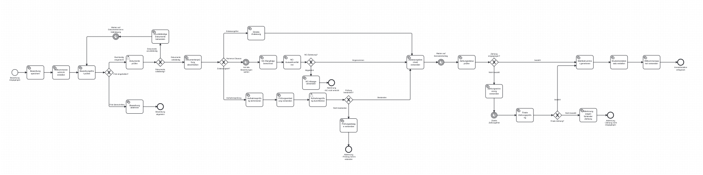

# IE-Project: Digitales Bewerbungsverfahren mit Camunda BPMN

Ein vollständiges digitales Bewerbungs- und Immatrikulationssystem für Universitäten, implementiert mit Spring Boot, Camunda BPMN und MySQL.

##  Inhaltsverzeichnis

1. [Projektübersicht](#projektübersicht)
2. [Technologie-Stack](#technologie-stack)
3. [Systemvoraussetzungen](#systemvoraussetzungen)
4. [Installation und Setup](#installation-und-setup)
5. [Anwendung starten](#anwendung-starten)
6. [Tests durchführen](#tests-durchführen)
7. [API-Endpunkte](#api-endpunkte)
8. [BPMN-Workflow](#bpmn-workflow)
9. [Datenbankschema](#datenbankschema)

##  Projektübersicht

Das IE-Project ist ein umfassendes digitales Bewerbungsverfahren für Universitäten, das den gesamten Prozess von der Bewerbungseinreichung bis zur Immatrikulation automatisiert. Das System verwendet Camunda BPMN für die Workflow-Orchestrierung und bietet verschiedene Zulassungsverfahren je nach Studiengang.

### Hauptfunktionen

- **Automatisierte Bewerbungsverarbeitung**: Vollständig digitaler Workflow von der Einreichung bis zur Entscheidung
- **Drei Zulassungsverfahren**:
    - Zulassungsfreie Studiengänge (OPEN)
    - Numerus Clausus mit Rangfolgenberechnung (NUMERUS_CLAUSUS)
    - Aufnahmeprüfungen (ENTRANCE_EXAM)
- **Intelligente Deadline-Prüfung**: Automatische Überprüfung der Bewerbungsfristen
- **Dokumentenvalidierung**: Benutzergesteuerte Überprüfung der eingereichten Unterlagen
- **Zahlungsüberwachung**: Verfolgung der Semesterbeitragszahlungen
- **Automatische Matrikelnummer-Generierung**: Eindeutige Studentennummern nach Hochschulstandard
- **Vollständige API**: REST-Endpunkte für alle Systemfunktionen

### Projektziele

1. **Prozessoptimierung**: Reduzierung manueller Arbeitsschritte im Bewerbungsverfahren
2. **Transparenz**: Nachvollziehbare Entscheidungswege durch BPMN-Modellierung
3. **Skalierbarkeit**: Unterstützung für verschiedene Studiengänge und Zulassungsverfahren
4. **Integration**: Schnittstellen für externe Systeme (Zahlungsanbieter, Studierendenverwaltung)
5. **Benutzerfreundlichkeit**: Intuitive Bedienung für Verwaltungspersonal und Bewerber

##  Technologie-Stack

- **Backend**: Spring Boot 3.4.4, Java 17
- **Workflow-Engine**: Camunda BPM 7.23.0
- **Datenbank**: MySQL 8.0
- **Build-Tool**: Maven 3.9.4
- **Containerisierung**: Docker & Docker Compose
- **Database Administration**: phpMyAdmin
- **Monitoring**: Spring Boot Actuator

##  Systemvoraussetzungen

Vor der Installation stellen Sie sicher, dass folgende Software installiert ist:

- **Docker**: Version 20.10 oder höher
- **Docker Compose**: Version 2.0 oder höher
- **Mindestens 4 GB RAM**: Für alle Container
- **Freie Ports**: 3306, 8080, 8082, 8090

### Ports-Übersicht

| Port | Service | Beschreibung |
|------|---------|-------------|
| 3306 | MySQL | Datenbankserver |
| 8080 | Spring Boot App | Hauptanwendung und API |
| 8082 | phpMyAdmin | Datenbankadministration |
| 8090 | Camunda Platform | Workflow-Management-System |

## 🚀 Installation und Setup

### 1. Repository klonen

```bash
git clone https://github.com/YoumbiFranck/ie-project ie-project
cd ie-project
```

### 2. Umgebungsvariablen (Optional)

Erstellen Sie eine `.env` Datei im Projektverzeichnis für benutzerdefinierte Konfigurationen:

```env
# =====================================================
# Environment Variables for IE Project
# Umgebungsvariablen für IE Projekt
# =====================================================

# Application Deadline Configuration / Bewerbungsfristen-Konfiguration
# Format: YYYY-MM-DD

# Winter semester deadline (01.08.2025) / Wintersemester-Deadline (01.08.2025)
APPLICATION_DEADLINE_WINTER=2025-08-01

# Summer semester deadline (01.02.2025) / Sommersemester-Deadline (01.02.2025)
APPLICATION_DEADLINE_SUMMER=2025-02-01

# Months before deadline for application submission / Monate vor Deadline für Bewerbungseinreichung
APPLICATION_DEADLINE_MONTHS_BEFORE=2

# Database Configuration / Datenbank-Konfiguration
MYSQL_ROOT_PASSWORD=root
MYSQL_DATABASE=camunda
MYSQL_USER=camunda
MYSQL_PASSWORD=camunda

# Spring Configuration / Spring-Konfiguration
SPRING_PROFILES_ACTIVE=docker
SPRING_DATASOURCE_URL=jdbc:mysql://mysql:3306/camunda?useSSL=false&allowPublicKeyRetrieval=true&serverTimezone=UTC
SPRING_DATASOURCE_USERNAME=camunda
SPRING_DATASOURCE_PASSWORD=camunda
SPRING_DATASOURCE_DRIVER_CLASS_NAME=com.mysql.cj.jdbc.Driver

# Camunda Configuration / Camunda-Konfiguration
CAMUNDA_BPM_DATABASE_TYPE=mysql
CAMUNDA_BPM_DATABASE_SCHEMA_UPDATE=true

# JPA Configuration / JPA-Konfiguration
SPRING_JPA_HIBERNATE_DDL_AUTO=none
SPRING_JPA_SHOW_SQL=false
SPRING_JPA_PROPERTIES_HIBERNATE_DIALECT=org.hibernate.dialect.MySQL8Dialect

# JVM Options / JVM-Optionen
JAVA_OPTS=-Xmx512m -Xms256m
```

### 3. Docker Images herunterladen

```bash
docker compose pull
```

##  Anwendung starten

### Erste Installation (mit Datenbankinitialisierung)

```bash
# Alle Container starten und Datenbank initialisieren
docker compose up --build -d
```

### Normale Verwendung

```bash
# Services starten
docker compose up

# Services stoppen
docker compose down

# Services neu starten
docker compose restart
```

### Startup-Reihenfolge

Das System startet automatisch in der korrekten Reihenfolge:

1. **MySQL** (mit Health Check)
2. **Camunda Platform** (wartet auf MySQL)
3. **Spring Boot Anwendung** (wartet auf MySQL)
4. **phpMyAdmin** (wartet auf MySQL)

### Verfügbarkeit prüfen

Warten Sie bis alle Services bereit sind (ca. 2-3 Minuten):

```bash
# Logs verfolgen
docker compose logs -f

# Status der Container prüfen
docker compose ps

# Health Check der Anwendung
curl http://localhost:8080/actuator/health
```

## 🔗 Zugriff auf die Services

Nach erfolgreichem Start sind folgende Services verfügbar:

| Service | URL | Anmeldedaten |
|---------|-----|-------------|
| **Spring Boot API** | http://localhost:8080 | - |
| **API Dokumentation** | http://localhost:8080/actuator | - |
| **Camunda Cockpit** | http://localhost:8090/camunda | admin / admin |
| **Camunda Tasklist** | http://localhost:8090/camunda/app/tasklist | admin / admin |
| **phpMyAdmin** | http://localhost:8082 | root / root |

##  Tests durchführen

### 1. Grundfunktionalität testen

```bash
# API Health Check
curl http://localhost:8080/actuator/health

# Verfügbare Studiengänge abrufen
curl http://localhost:8080/api/applications/study-programs

# Camunda Cockpit aufrufen
curl http://localhost:8080/camunda/
# oder direkt im Browser öffnen: http://localhost:8080/camunda/app/cockpit/default/#/login
```

### 2. Bewerbung einreichen (API Test) (wichtig für den Start des Workflows)

Erstellen Sie eine Datei `test-application.http`:

```http
### Neue Bewerbung einreichen
POST http://localhost:8080/api/applications
Content-Type: application/json

{
  "firstName": "Max",
  "lastName": "Mustermann",
  "sex": "M",
  "email": "max.mustermann@example.com",
  "dateOfBirth": "1995-05-15",
  "street": "Musterstraße 123",
  "city": "Musterstadt", 
  "postalCode": "12345",
  "country": "Deutschland",
  "phone": "+49 123 456789",
  "studyProgramId": 1,
  "highSchoolGrade": 2.1
}
```

### 3. Zahlungssimulation testen

```http
### Zahlung als bezahlt markieren
POST http://localhost:8080/api/payment/update-status
Content-Type: application/json

{
  "applicationId": 1,
  "paid": true
}

### Zahlungsstatus prüfen
GET http://localhost:8080/api/payment/status/1
```

### 4. Workflow in Camunda verfolgen

1. Öffnen Sie http://localhost:8080/camunda
2. Melden Sie sich an: `demo` / `demo`
3. Gehen Sie zu **Cockpit** → **Processes**
4. Wählen Sie **Student Application Process**
5. Verfolgen Sie die Prozessinstanzen

### 5. User Tasks bearbeiten

1. Öffnen Sie http://localhost:8080/camunda/app/tasklist
2. Melden Sie sich an: `demo` / `demo`
3. Bearbeiten Sie offene Aufgaben (z.B. Dokumentenprüfung)

##  API-Endpunkte

### Bewerbungs-API

| Methode | Endpunkt | Beschreibung |
|---------|----------|-------------|
| POST | `/api/applications` | Neue Bewerbung einreichen |
| GET | `/api/applications/study-programs` | Verfügbare Studiengänge abrufen |
| GET | `/api/applications/health` | API Health Check |

### Zahlungs-API

| Methode | Endpunkt | Beschreibung |
|---------|----------|-------------|
| POST | `/api/payment/update-status` | Zahlungsstatus aktualisieren |
| GET | `/api/payment/status/{id}` | Zahlungsstatus abfragen |
| POST | `/api/payment/simulate-bulk-payment` | Massenzahlungssimulation |

### Monitoring-Endpunkte

| Methode | Endpunkt | Beschreibung |
|---------|----------|-------------|
| GET | `/actuator/health` | Systemgesundheit |
| GET | `/actuator/info` | Anwendungsinfo |
| GET | `/actuator/mappings` | Verfügbare Endpunkte |

##  BPMN-Workflow

Das Herzstück des Systems ist ein umfassender BPMN-Workflow, der den gesamten Bewerbungs- und Immatrikulationsprozess abbildet.

### Workflow-Übersicht




### Prozessschritte im Detail

#### 1. Bewerbungseingang
- **Startpunkt**: Bewerbung wird über API eingereicht
- **Speicherung**: Daten werden in der Datenbank gespeichert
- **Willkommensnachricht**: Automatische Bestätigung

#### 2. Deadline-Prüfung
- **Fristberechnung**: Automatische Überprüfung der Einreichungsfristen
- **Semester-Ermittlung**: Winter- oder Sommersemester
- **Entscheidung**: Rechtzeitig oder verspätet

#### 3. Dokumentenprüfung (User Task)
- **Manuelle Prüfung**: Mitarbeiter überprüft eingereichte Dokumente
- **Formulareingabe**: Vollständigkeit und Anmerkungen
- **Rückläufer**: Bei unvollständigen Dokumenten

#### 4. Zulassungsverfahren (Gateway)

Das System unterstützt drei verschiedene Zulassungsverfahren:

##### A) Zulassungsfreie Studiengänge (OPEN)
- **Direktzulassung**: Automatische Zulassung bei erfüllten Grundvoraussetzungen
- **Weiterleitung**: Direkt zum Zulassungsbescheid

##### B) Numerus Clausus (NUMERUS_CLAUSUS)
- **Wartezeit**: Timer-Event wartet auf alle Bewerbungen
- **Rangfolge-Berechnung**: Sortierung nach Abiturnote und Eingangsdatum
- **Quotenverfahren**: Berücksichtigung von Geschlechterquoten
- **Auswahlentscheidung**: Zulassung oder Ablehnung basierend auf verfügbaren Plätzen

##### C) Aufnahmeprüfung (ENTRANCE_EXAM)
- **Prüfungsplanung**: Terminierung der Aufnahmeprüfung
- **Einladungsversand**: Benachrichtigung der Bewerber
- **Prüfungsdurchführung**: User Task für Professoren
- **Bewertung**: Bestanden oder nicht bestanden

#### 5. Zulassungsbescheid
- **Benachrichtigung**: Versand des offiziellen Zulassungsbescheids
- **Zahlungsaufforderung**: Information über Semesterbeitrag

#### 6. Zahlungsüberwachung
- **Erste Zahlungsfrist**: Timer-Event mit 4 Wochen
- **Zahlungsprüfung**: Automatische Überprüfung des Zahlungsstatus
- **Erinnerung**: Bei ausbleibender Zahlung
- **Zweite Chance**: Zusätzliche Frist
- **Finale Entscheidung**: Zulassung verfällt oder Immatrikulation

#### 7. Immatrikulation
- **Matrikelnummer-Generierung**: Eindeutige Studentennummer
- **Studentendatensatz**: Erstellung in der Studierendendatenbank
- **Willkommenspaket**: Finale Benachrichtigung mit Studienunterlagen

### Gateway-Entscheidungen

Das System verwendet verschiedene Gateways für automatische Entscheidungen:

| Gateway | Bedingung | Pfad |
|---------|-----------|------|
| **Deadline** | `isApplicationOnTime == true` | Weiter zur Dokumentenprüfung |
|  | `isApplicationOnTime == false` | Ablehnung |
| **Dokumente** | `documentsComplete == true` | Weiter zum Zulassungsverfahren |
|  | `documentsComplete == false` | Zurück zur Nachreichung |
| **Zulassungsart** | `admissionType == 'OPEN'` | Direktzulassung |
|  | `admissionType == 'NUMERUS_CLAUSUS'` | NC-Verfahren |
|  | `admissionType == 'ENTRANCE_EXAM'` | Aufnahmeprüfung |
| **NC-Ergebnis** | `ncAdmissionDecision == 'ACCEPTED'` | Zulassungsbescheid |
|  | `ncAdmissionDecision == 'REJECTED'` | NC-Absage |
| **Prüfungsergebnis** | `examPassed == true` | Zulassungsbescheid |
|  | `examPassed == false` | Prüfungsablehnung |
| **Zahlung** | `paymentReceived == true` | Immatrikulation |
|  | `paymentReceived == false` | Erinnerung oder Ablehnung |

##  Datenbankschema

Das System verwendet drei Haupttabellen:

### 1. study_programs
```sql
- id (PRIMARY KEY)
- name (Studiengangsname)
- code (Kurzel, z.B. "INF", "BWL")
- admission_type (OPEN, NUMERUS_CLAUSUS, ENTRANCE_EXAM)
- max_students (Maximale Studienplätze)
- created_at (Erstellungszeitpunkt)
```

### 2. applications
```sql
- id (PRIMARY KEY)
- first_name, last_name (Personendaten)
- email (Eindeutige E-Mail-Adresse)
- date_of_birth, phone (Kontaktdaten)
- street, city, postal_code, country (Adresse)
- study_program_id (FOREIGN KEY zu study_programs)
- high_school_grade (Abiturnote für NC-Verfahren)
- status (SUBMITTED, DOCUMENT_CHECK, ACCEPTED, REJECTED, ENROLLED)
- tuition_fee_paid (Zahlungsstatus)
- camunda_process_instance_id (Verknüpfung zum BPMN-Prozess)
- created_at, updated_at (Zeitstempel)
```

### 3. students
```sql
- id (PRIMARY KEY) 
- student_number (Matrikelnummer, eindeutig)
- first_name, last_name, email (Personendaten)
- study_program_id (FOREIGN KEY zu study_programs)
- enrollment_date (Immatrikulationsdatum)
- current_semester (Aktuelles Fachsemester)
- application_id (FOREIGN KEY zu applications)
- created_at, updated_at (Zeitstempel)
```

### Vorgefüllte Testdaten

Das System wird mit folgenden Studiengängen initialisiert:

| Code | Name | Zulassungsart | Max. Studenten |
|------|------|---------------|----------------|
| INF | Informatik | NUMERUS_CLAUSUS | 100 |
| BWL | Betriebswirtschaftslehre | NUMERUS_CLAUSUS | 150 |
| MB | Maschinenbau | OPEN | - |
| MED | Medizin | ENTRANCE_EXAM | 50 |
| PHIL | Philosophie | OPEN | - |


### Delegate-Übersicht

Jeder Schritt im BPMN-Workflow wird durch einen spezialisierten Java-Delegate implementiert:

| Delegate | Zweck | Prozessschritt |
|----------|-------|----------------|
| **SaveApplicationDelegate** | Bewerbung in DB speichern | Nach Eingang |
| **WelcomeMessageDelegate** | Bestätigungsnachricht | Nach Speicherung |
| **DeadlineCheckDelegate** | Fristprüfung | Deadline-Validierung |
| **AdmissionTypeDelegate** | Zulassungsart bestimmen | Gateway-Routing |
| **DirectAdmissionDelegate** | Direkte Zulassung | OPEN-Studiengänge |
| **NCRankingDelegate** | Rangfolge berechnen | NC-Verfahren |
| **NCSelectionDelegate** | Auswahl treffen | NC-Entscheidung |
| **ScheduleExamDelegate** | Prüfung planen | Aufnahmeprüfung |
| **ExamInvitationDelegate** | Einladung versenden | Vor Prüfung |
| **AdmissionLetterDelegate** | Zulassungsbescheid | Nach Zulassung |
| **PaymentCheckDelegate** | Zahlungsprüfung | Semesterbeitrag |
| **GenerateStudentNumberDelegate** | Matrikelnummer | Vor Immatrikulation |
| **CreateStudentRecordDelegate** | Studentendatensatz | Immatrikulation |
| **WelcomePackageDelegate** | Willkommenspaket | Nach Immatrikulation |


---

